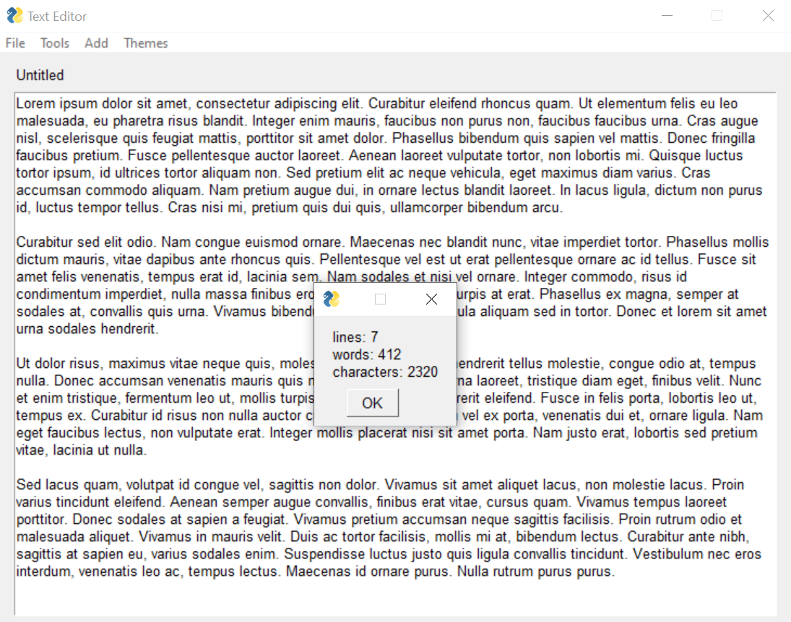

Simple Graphical User Interface applications made in Python.

Used PySimpleGUI library which itself act's as a wrapper around the Tkinter library.

---

**Screenshots**

---

**Converter**

- A simple converter application which is provides options to convert different metrics.
- Capable of converting Celsius to Fahrenheit, seconds to minutes, KG to Pounds, KM to Mile etc.,

---

**Calculator**

- Simple calculator application for basic calculations.
- Added options to change theme of the app by providing multiple themes and a random theming option.

---

**Text Editor**

- Text editor with a fully functional GUI which can create a new text file or open and existing text file and edit the contents of the file.

- Added various features, such as word count, which provides information about the number of characters, words, and lines.

- Implemented title bar and file menu bar.
- Added theming support and provided multiple theming options according to user's preferences.

- Provided an option to insert various ASCII based emojis which is built right into the editor.

